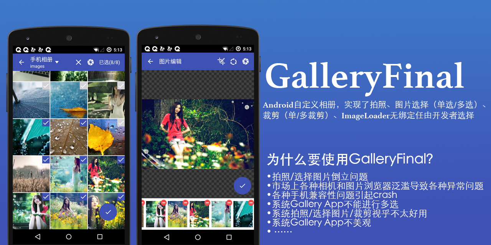

# galleryfinal
## 项目说明
GalleryFianl项目本来是[pengjianbo](https://github.com/pengjianbo/GalleryFinal)用android studio开发的，由于本人使用的是eclipse开发环境，所以，将该项目转为eclipse，过程比较复杂，不多说。
## 项目展示

## BUG修复
在图片选择，编辑activity中打开照相机，拍照失败，失败原因是uri变量被重置。修改如下(增加 android:configChanges="orientation|keyboardHidden|screenSize")：
```xml
   <activity
            android:name=".PhotoSelectActivity"
            android:label="@string/app_name"
            android:configChanges="orientation|keyboardHidden|screenSize" >
        </activity>
        <activity
            android:name=".PhotoEditActivity"
            android:label="@string/app_name"
            android:configChanges="orientation|keyboardHidden|screenSize" >
        </activity>
```


